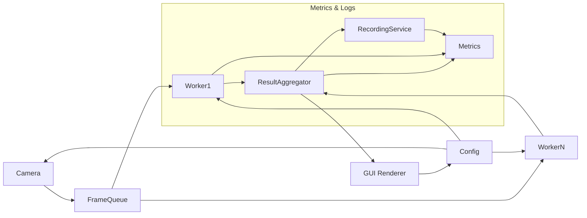

# 1. 目的 / 範囲
マルチカメラ手ジェスチャー解析システムの高水準構造定義。実装詳細/最適化コードは含めない。

# 2. アーキテクチャ概要
コンポーネント: CameraService / FrameQueue / InferenceWorkers (N, multiprocessing) / OpenVINOAdapter / ResultAggregator / GUIRenderer / RecordingService / ConfigService / MetricsService / HealthWatcher.



# 3. ディレクトリ / モジュール構成 (実装配置方針)
```
ProgramName/
  services/
    __init__.py
    camera_service.py         # CameraService
    inference_service.py      # InferenceService / ワーカー起動補助
    openvino_adapter.py       # OpenVINOAdapter (推論最適化層)
    result_aggregator.py      # ResultAggregator
    gui_renderer.py           # GUIRenderer (GUI 選定後中身実装)
    recording_service.py      # RecordingService
    config_service.py         # ConfigService (YAML/JSON 読み書き)
    metrics_service.py        # MetricsService (ローカル記録)
    health_watcher.py         # HealthWatcher (状態集計)
    offline_guard.py          # OfflineGuard (外部通信禁止検査)
  models/                     # 型/IRモデル/データクラス (将来 types.py 等)
  common/                     # 例外, ロギング等共通
  resources/                  # 設定/モデル/静的リソース
  results/                    # 生成物 (録画, メトリクス)
  tests/                      # unit / integration / performance
```

実装ガイド:
* サービス層は scripts 配下 1 ファイル 1 役割を原則。
* GUI 実装はフレームワーク決定 (OQ-02) までプレースホルダ。
* OpenVINOAdapter は推論前後処理 (前処理/後処理/変換キャッシュ管理) を担当し InferenceService から利用。

# 4. データフロー (概略)
1. CameraService: フレーム取得 → FrameQueue (BATCH/単発)。
2. InferenceWorker: Queue から取り出し → OpenVINOAdapter 推論 → 結果送信。
3. ResultAggregator: 最新結果を保持し GUI / Recorder へ通知。
4. RecordingService: 映像ストリーム + メタ同期書込 (タイムスタンプ基準)。

# 5. モジュールとFR対応
| モジュール | 主FR | 補助FR |
|------------|------|--------|
| CameraService | FR-001 | FR-011 |
| InferenceWorkers + OpenVINOAdapter | FR-002/003/004 | FR-013 |
| GUIRenderer | FR-005 | FR-013 |
| ConfigService | FR-006 | FR-011 |
| RecordingService | FR-007/008 | FR-009 |
| MetricsService | FR-009 | FR-013 |
| OfflineGuard(起動チェック) | FR-010 | - |

# 6. インターフェース概要 (関数シグネチャのみ)
- CameraService: list()->[Camera]; start(id)->bool; stop(id)->bool; grab()->Frame
- InferenceService: load_model(path)->None; infer(batch:[Frame])->[GestureEvent]
- RecordingService: start(meta)->recording_id; append(frame, events)->None; stop(id)->path
- ConfigService: load()->Config; save(partial:dict)->None; watch(callback)->None
- MetricsService: record(name:str,value:float,tags:dict)->None
- HealthWatcher: snapshot()->HealthStatus

# 7. データモデル要約
| Entity | Key | 主属性 | 備考 |
|--------|-----|--------|------|
| Camera | camera_id | name,resolution,fps,enabled | 設定ファイル |
| FrameMeta | frame_id | camera_id,timestamp | 画像はメモリのみ |
| GestureEvent | event_id | frame_id,label,confidence,bbox | 信頼度0-1 |
| Recording | recording_id | start_ts,end_ts,path | 状態管理 |
| Config | key | value | YAML/JSON |

# 8. 状態機械 (録画)
| State | Next | 条件 |
|-------|------|------|
| idle | recording | start() 呼び出し |
| recording | stopping | stop() 呼び出し |
| stopping | idle | flush 完了 |

# 9. 並列/性能設計要点
- multiprocessing: ワーカー数 = min(物理コア-1, カメラ数)
- フレームキュー: バックプレッシャー (最大長 L、超過でフレーム間引き)
- OpenVINO: 初回起動で変換キャッシュ (.blob/.xml+bin)
- 時間計測: t_capture, t_queue, t_infer, t_render

# 10. 非機能対策対応表
| 要件 | 設計要点 |
|------|---------|
| 遅延<100ms | バッチサイズ=1 + ピン留めプロセス優先度検討 |
| FPS>=20 | 並列ワーカー動的調整 / 間引き |
| CPU≤85% | iGPU 利用 + OpenVINO FP16 |
| オフライン | 外部通信禁止チェック (socket monkeypatch) |
| 可用性 | Worker 監視 & 自動再起動 |
| ログ/計測 | JSON構造ログ + 指標5種 (latency,fps,queue,errors,record_size) |

# 11. 例外/エッジケース簡易方針
| ケース | 対応 |
|--------|------|
| カメラ切断 | 再接続リトライ→失敗で無効化通知 |
| モデル変換失敗 | 旧モデル継続 + 警告 |
| ディスク不足 | 録画停止 + GUI警告 |
| 高遅延 | キュー深さ調整 / 間引き通知 |
| 設定破損 | デフォルト再生成 + バックアップ復元 |

# 12. 設定主要キー (例)
| Key | 意味 | 例 | 変更可 |
|-----|------|----|-------|
| cameras[].id | 論理ID | cam0 | ◯ |
| cameras[].resolution | WxH | 1280x720 | ◯ |
| inference.model_path | モデル | models/model.pt | ◯ |
| inference.device | CPU/iGPU | CPU | ◯ |
| recording.output_dir | 出力先 | results/rec | ◯ |
| recording.max_disk_gb | 上限 | 200 | ◯ |
| perf.max_queue | キュー最大 | 30 | ◯ |

# 13. ログ/メトリクス (列挙)
- Logs: audit_action, error, perf(latency breakdown)
- Metrics: inference_latency_ms, fps_per_camera, queue_depth, dropped_frames, disk_usage_gb

# 14. セキュリティ/オフライン
- 外部ソケット禁止 (起動時 DNS/HTTP 呼び出し未実行検証)
- ファイル権限(録画/モデル) 初期化時制限

# 15. テスト戦略要約
| 種 | 主対象 | 例 |
|----|--------|----|
| Unit | InferenceWorker, Configパース | 依存モック |
| Integration | カメラ→推論→GUIダミー | FPS/遅延計測 |
| Performance | 2/4カメラシナリオ | レイテンシ統計 |
| Resilience | Worker kill | 自動復帰確認 |

# 16. オープン課題リンク
OQ-01, OQ-02, OQ-03, OQ-04, OQ-05, OQ-06, OQ-07 (要件.md参照)

# 17. 非範囲 (除外)
- モバイル/クラウド/リモート管理, 自動学習再訓練, 分散スケールアウト。

# 18. 将来拡張プレースホルダ
- Gesture拡張 (骨格推定) / プラグインモデル切替 / GPU (dGPU) 最適化。

(以上: 実装前レビュー用 / 次は 詳細設計.md を参照)
