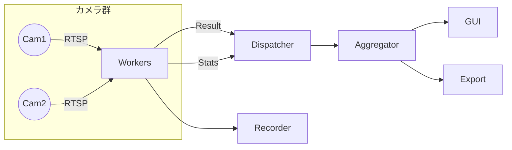

# 基本設計_概略.md

バージョン: 0.1 (2025-08-16)
目的: 初学者 / 新規参加メンバー向けにシステムの全体像を平易に説明する。

---
## 1. 何をするシステムか
複数のネットワークカメラ(RTSP)映像を同時に読み取り、手のジェスチャーをAIモデル(OpenVINO)で判定し、画面表示や録画、結果のエクスポート(csv/jsonl)を行うリアルタイム解析基盤です。

---
## 2. 全体イメージ図


---
## 3. 主な部品と役割
| 名前 | やること | もう少し詳しく |
|------|----------|-----------------|
| Worker | 映像を取り AI 推論 | 1カメラ=1プロセス (初期) で遅延を減らす |
| Orchestrator | Worker の開始/停止/監視 | 異常時の再起動・統計集計トリガ |
| Aggregator | 推論結果を貯め素早く参照 | 最新順リングバッファで古い物を自動的に捨てる |
| GUIAdapter | 内部データ→表示用に整える | 数値やラベルをユーザ向け形式に加工 |
| Recorder | 映像+メタ情報を保存 | 後から再解析/証跡に利用 |
| ConfigLoader | XML 設定を読み取り検証 | 不正なら即エラー停止 |
| Logging (集中) | ログを一か所にまとめる | 全 Worker から Queue 経由で集約 |

---
## 4. ざっくりデータの流れ
1. 起動時に設定 XML を読み込む。
2. カメラごとに Worker プロセスを立ち上げる。
3. 各 Worker がフレーム→前処理→推論→結果をキューへ送る。
4. Orchestrator 内部の ResultDispatcherThread が結果を受け取り Aggregator に渡す。
5. GUI / Export / Recorder が Aggregator から必要な情報を取り出す。

---
## 5. 代表的なデータ項目
| 名称 | 説明 | 例 |
|------|------|----|
| ResultRecord | 1フレームの判定結果 | camera=cam01, gesture=swipe, confidence=0.87 |
| StatsMessage | 1秒単位の統計 | fps=9.8, avg_latency_ms=120 |
| Config | 設定全体 | カメラリスト, モデルパス 等 |

---
## 6. 処理と遅延の工夫
- キューは “最新優先”: 混雑したら古い結果を捨てる → 表示の遅延を貯めない。
- 推論レイテンシ測定で遅いカメラを検知 (警告ログ)。
- FPS 目標を設定しサボっているカメラ(ストール)を発見。

---
## 7. エラー時の挙動
| ケース | 振る舞い | 理由 |
|--------|----------|------|
| 設定が不正 | すぐ停止 | 間違った設定で動作しても意味が無い |
| カメラ接続失敗 | 再試行 (回数制限) | ネットワークの一時的揺らぎ対応 |
| 推論一部失敗 | そのフレームだけ捨て続行 | 連続エラーでなければ問題ない |
| モデルロード失敗 | 即停止 | 解析できないため |

---
## 8. ログの見方
JSON 形式 (例):
```json
{"ts":"2025-08-16T08:40:12.345Z","level":"INFO","event":"STARTUP_COMPLETE","camera":null,"msg":"system ready"}
```
よく見る event:
| event | 意味 |
|-------|------|
| STARTUP_COMPLETE | 正常起動完了 |
| CAPTURE_RETRY | カメラ再接続中 |
| INFER_FAIL | 推論失敗 (単発) |
| RESULT_DROP | 古い結果を捨てた |
| CAMERA_STALL | 更新が止まった |

---
## 9. テストの方向性 (初心者向け)
| テスト種別 | 目的 | 例 |
|------------|------|----|
| Unit | 部品単位が正しいか | RingBuffer が上限超えで古い物を捨てる |
| Integration | 部品連携 | 2カメラ同時に起動し結果取得 |
| Performance | 目標 FPS/遅延確認 | 10fps 達成か |
| Fault Injection | 障害耐性 | カメラを故意に落として再接続確認 |

---
## 10. 今後の拡張候補
- Worker を Capture と Inference に分離 (CPU/I/O 分散)。
- シリアライズを msgpack に変更。
- OpenTelemetry 連携でメトリクス送信。

---
## 11. 用語ミニ辞書
| 用語 | 簡単な意味 |
|------|-------------|
| RTSP | ネットワーク越しの映像配信プロトコル |
| OpenVINO | Intel 系推論最適化ランタイム |
| RingBuffer | 一定サイズを超えると古いデータを上書きするバッファ |
| レイテンシ | 処理にかかった時間 |

---
(以上)
