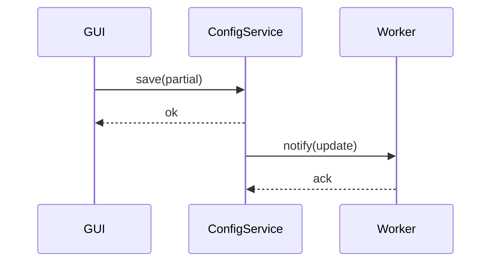

# 1. 方針
コード断片は省略し、インターフェース/スレッド・プロセス構造/主要アルゴリズム要点のみ記述。Google Docstring & 型必須。後方互換ラッパ禁止。

# 2. プロセス / スレッドモデル
| 名称 | 種別 | 役割 | 終了条件 | 監視 |
|------|------|------|----------|------|
| main | プロセス | 初期化/GUI起動 | ユーザ終了 | HealthWatcher |
| worker_n | プロセス | 推論 (1..N) | main終了/異常 | main 再起動指示 |
| recorder | スレッド | 映像+メタ書込 | 停止要求 | main |
| metrics | スレッド | 定期集計(1s) | main終了 | main |

# 3. 主要キュー / バッファ
| 名称 | 型 | Producer | Consumer | 上限 | ポリシー |
|------|----|----------|----------|------|----------|
| frame_queue | multiprocessing.Queue[Frame] | CameraService | worker_n | perf.max_queue | 超過: 最古drop |
| result_queue | Queue[InferenceResult] | worker_n | ResultAggregator | 2 * workers | 超過: 先頭drop |
| record_queue | Queue[RecordItem] | ResultAggregator | recorder | 1000 | 超過: 低優先度skip |

# 4. データ構造 (型概要)
```text
Frame: {id:int, camera_id:str, ts:float, img:ndarray}
GestureEvent: {id:int, frame_id:int, label:str, conf:float, bbox:(x,y,w,h)}
InferenceResult: {frame_id, events:[GestureEvent], latency_ms:float}
Config: {cameras:[{id,resolution,fps,enabled}], inference:{model_path,device}, recording:{output_dir,max_disk_gb}, perf:{max_queue}}
HealthStatus: {workers_alive:int, queue_depth:int, fps:float}
```

# 5. インターフェース詳細 (入出力のみ)
| コンポーネント | 関数 | 入力 | 出力 | 例外 |
|---------------|------|------|------|------|
| CameraService | list | None | [Camera] | IOError |
| CameraService | grab | camera_id | Frame | RuntimeError |
| InferenceService | load_model | path:str | None | FileNotFoundError, ValueError |
| InferenceService | infer | frames:[Frame] | [GestureEvent] | RuntimeError |
| RecordingService | start | meta:dict | recording_id:str | IOError |
| RecordingService | append | frame, events | None | IOError |
| RecordingService | stop | recording_id | path:str | IOError |
| ConfigService | load | None | Config | ValueError |
| ConfigService | save | partial:dict | None | ValueError |
| MetricsService | record | name,value,tags | None | - |
| HealthWatcher | snapshot | None | HealthStatus | - |

# 6. 推論アルゴリズム概要
1. 受信フレーム (単体) を RGB 正規化。
2. モデル入力サイズへリサイズ/パディング。
3. OpenVINO 推論 (FP16)。
4. 出力後処理: スコア閾値 conf >= 0.5 でフィルタ。
5. 座標補正 (リサイズ逆変換)。
6. イベント生成 → result_queue。

# 7. OpenVINO 変換フロー
| ステップ | 入力 | 出力 | 失敗時 |
|----------|------|------|--------|
| 1 | PyTorch .pt | ONNX | ログ & 中断 |
| 2 | ONNX | IR (.xml/.bin) | ログ & 旧IR維持 |
| 3 | IR | 最適化キャッシュ | 警告 |

# 8. 並列制御
- ワーカー生成: N = min(physical_cores-1, camera_count)
- Graceful停止: main が stop_event を全ワーカーへ → キュー drain → join
- 監視: 1s 間隔で存否チェック。死活時: 再起動 (最大3回)。

# 9. 録画フォーマット
| 項目 | 方式 |
|------|------|
| 映像 | コンテナ: MP4 (H.264) / 代替 MJPEG | 
| メタ | JSON lines (frame_id, events[]) | 
| 同期 | timestamp 基準 (±5ms 許容) |
| ローテ | max_disk_gb 超過: 最古録画削除 |

# 10. 設定リロードシーケンス


# 11. エラーハンドリング詳細
| ケース | 検出 | リカバリ | ログレベル |
|--------|------|---------|-----------|
| カメラ切断 | grab失敗回数>3 | 再接続試行 | WARNING |
| ワーカー停止 | 監視スレッド | 再起動 | ERROR |
| モデル変換失敗 | 変換戻り値 | 旧IR継続 | ERROR |
| ディスク不足 | 書込例外 | 録画停止 | ERROR |
| 高遅延 | latency>閾値 | 間引き通知 | WARNING |

# 12. メトリクス集計
| 指標 | 算出 | 使用 |
|------|------|------|
| inference_latency_ms | t_out - t_in | SLA監視 |
| fps_per_camera | frame_count/秒 | 性能調整 |
| queue_depth | len(frame_queue) | バックプレッシャー |
| dropped_frames | 計測差分 | 最適化指標 |
| disk_usage_gb | size(scan) | クリーニング |

# 13. 性能最適化レバー
- フレームリサイズ: 高速アルゴリズム (cv2.INTER_AREA)
- バッチ推論: (将来) カメラ数増時に batch=2 オプション
- FP16 / iGPU デバイス優先
- キュー間引き: oldest-drop or skip-every-n

# 14. セキュリティ / オフライン検査
| チェック | 方法 | 頻度 |
|----------|------|------|
| 外部通信禁止 | ソケット monkeypatch / netstat 差分 | 起動時 |
| ファイル権限 | chmod/stat 検査 | 起動時 |
| ログ改ざん | 追記専用+ハッシュ | ローテ時 |

# 15. テスト観点マトリクス
| 観点 | ケース例 |
|------|---------|
| 性能 | 1/2/4カメラ遅延/FPS |
| 信頼性 | Worker kill 後復帰 |
| 耐障害 | ディスク不足/カメラ切断 |
| 品質 | 型チェック/mypy 無エラー |
| セキュリティ | 外部通信0確認 |

# 16. 移行/バージョン互換
- モデル差替え: load_model() ランタイム再読み込み。旧構造保持なし。
- 設定キー追加: デフォルト付与。削除: 即時エラー→明示修正。

# 17. オープン課題対応ポインタ
- OQ-01: ラベル集合 → infer 後処理閾値再調整必要。
- OQ-02: GUI選定 → GUIRenderer 実装差異 (signal/slot)。
- OQ-03: YAML vs JSON → ConfigService 実装分岐。決定まで抽象IF。

# 18. リスク低減トリガ
| リスクID | 監視指標 | 発火条件 | アクション |
|---------|---------|---------|----------|
| R-02 | inference_latency_ms | p95>120ms 3分継続 | ワーカー+1 or 間引き |
| R-03 | disk_usage_gb | >90% | 古い録画削除 |
| R-04 | conf 平均 | <期待-Δ | モデル差替検討 |

# 19. 変更管理
- 破壊的IF変更は PR テンプレに "BREAKING" 行を追加。
- 旧関数残存禁止 (デプリケーションラッパ不使用)。

# 20. 将来拡張フック
| 項目 | 抽象点 |
|------|--------|
| モデルAPI | OpenVINOAdapter を Strategy化 |
| GUIテーマ | Renderer に ThemeProvider 注入 |
| ストレージ | RecordingService backend 抽象 | 

(以上: 実装ガイドライン)
