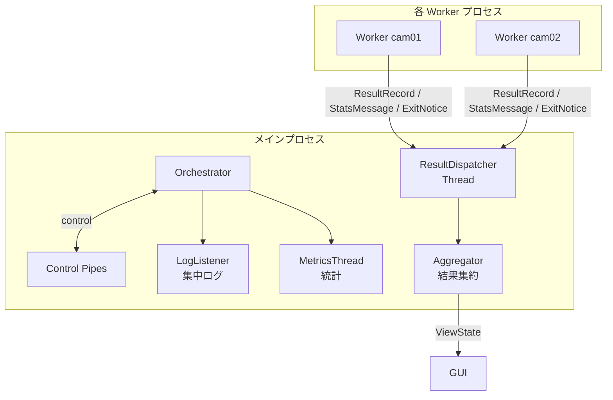
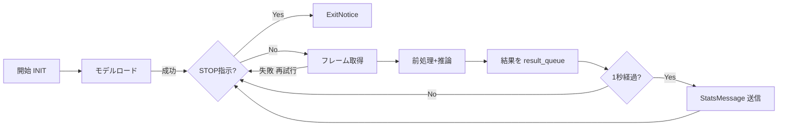
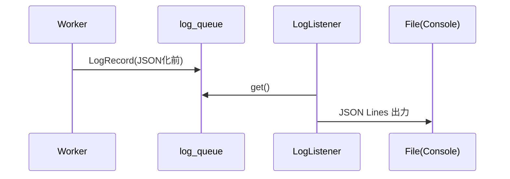

# 詳細設計_概略.md

バージョン: 0.1 (2025-08-16)
目的: 初心者/新メンバー向けに詳細設計のポイントを平易に可視化。GitHub Copilot 用の圧縮表現とは別に読みやすさを重視。

---
## 1. コンポーネント相関図

---
## 2. プロセスとキュー/パイプ
| 名称 | 種別 | 役割 | 重要ポイント |
|------|------|------|--------------|
| result_queue | multiprocessing.Queue | 推論結果/統計受け渡し | 満杯時 古い結果ドロップ |
| control_pipe | Pipe (親⇄各子) | 制御・状態 | STOP/PING/StatusUpdate |
| log_queue | multiprocessing.Queue | ログ集中 | QueueHandler 利用 |

---
## 3. メッセージ概要
| 型 | 主フィールド | 送信元→先 | 目的 |
|----|--------------|-----------|------|
| ControlMessage | type,payload | 親→子 | STOP/PING 等 |
| StatusUpdate | camera_id,status | 子→親 | 状態表示/再起動判断 |
| StatsMessage | camera_id,fps,avg_latency_ms | 子→親 | 統計融合/監視 |
| ExitNotice | camera_id,code,reason | 子→親 | 終了検知 |

---
## 4. Worker のループ (簡略図)

---
## 5. Aggregator の役割
- カメラごとのリングバッファ (最新優先) 保持
- 統計 (fps, 平均レイテンシ, 最終更新時刻, ドロップ率) を保持
- GUI / Export へクエリ API を提供

---
## 6. ログパイプライン

---
## 7. 主要インタフェース (意図レベル)
| 名前 | 入力 | 出力 | 概要 |
|------|------|------|------|
| ConfigLoader.load | path | Config | 設定 XML → 構造体 |
| Orchestrator.start | - | - | 各種初期化+Worker起動 |
| Orchestrator.stop | timeout | - | 停止指示→終了監視 |
| Aggregator.push | record/message | - | 結果/統計を内部保存 |
| Aggregator.query | camera_id,since | list | 条件取得 |
| Aggregator.export | fmt,range,dest | Path | ファイル出力 (csv/jsonl) |
| Recorder.start/stop | camera_id | Path? | 録画制御 |

---
## 8. エラーと対応
| 例 | 発生場所 | 対応 | ログ event |
|----|----------|------|-----------|
| モデルロード失敗 | Worker 起動時 | 即 ExitNotice(code≠0) | MODEL_LOAD_ERROR |
| カメラ切断 | Worker ループ | 再試行→上限で DOWN | CAPTURE_RETRY / CAMERA_DOWN |
| 結果キュー満杯 | Worker put | 古い結果1件捨てる | RESULT_DROP |
| 長時間更新なし | MetricsThread | WARNING ログ | CAMERA_STALL |

---
## 9. パフォーマンス指標
| 指標 | 目標 | 取得方法 |
|------|------|----------|
| FPS | 設定 target ± 許容 | StatsMessage fps |
| 推論レイテンシ p95 | < 500ms (暫定) | latency_ms 集計 |
| ドロップ率 | 低 (<5%) | drop_count / (produced+drop) |

---
## 10. テスト観点まとめ
| 観点 | 例 | 目的 |
|------|----|------|
| RingBuffer容量 | 超過時先頭消去 | メモリ制御 |
| 2カメラ並列 | 結果が双方来る | IPC 正常性 |
| キュー飽和 | 小容量設定 | ドロップ動作検証 |
| Fault Injection | モデルロード例外 | 異常終了ログ確認 |
| Shutdown | STOP ブロードキャスト | すべての ExitNotice 確認 |

---
## 11. 将来の改善メモ
- msgpack 化で IPC 軽量化
- Worker 分離 (Capture / Infer)
- 遅延しきい値超過フレームの画像ダンプ (デバッグ)
- OpenTelemetry でメトリクス配信

---
## 12. 用語簡易集
| 用語 | 説明 |
|------|------|
| StatsMessage | 1秒ごとの統計情報メッセージ |
| ExitNotice | プロセス終了時の通知メッセージ |
| Drop | キュー満杯で捨てた結果 |

---
(以上)
